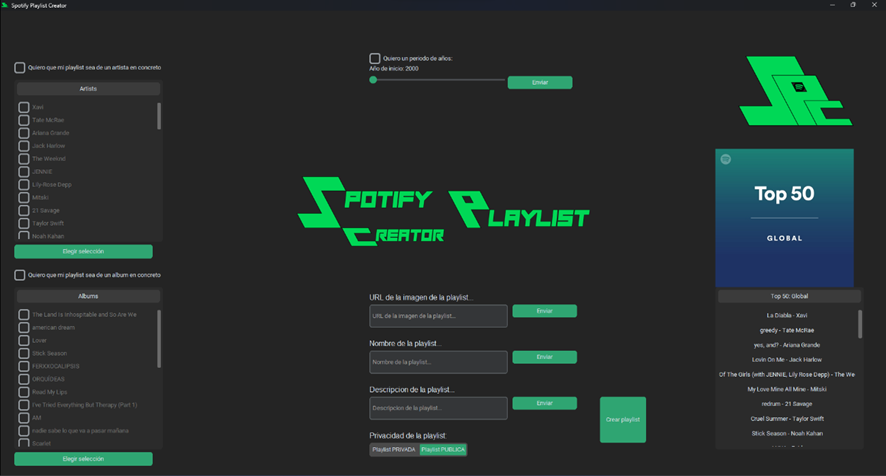
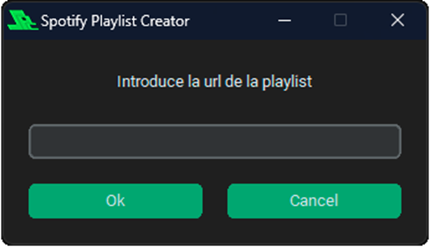
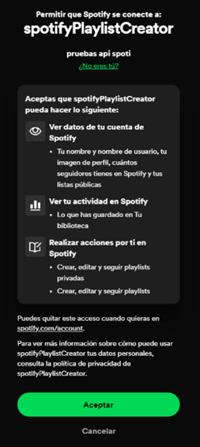
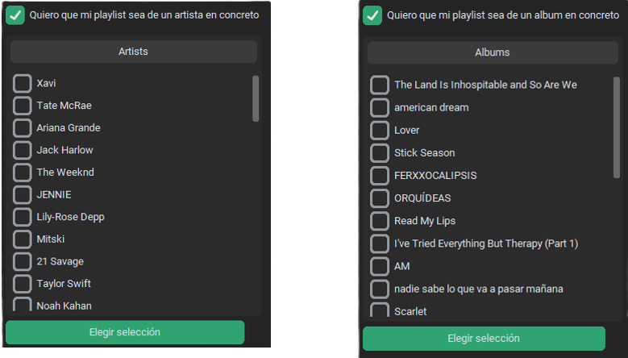
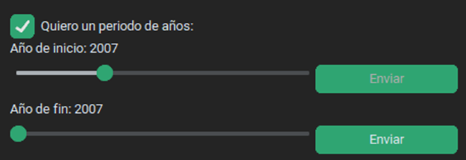
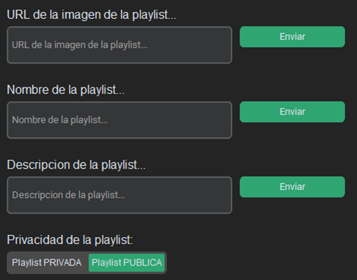
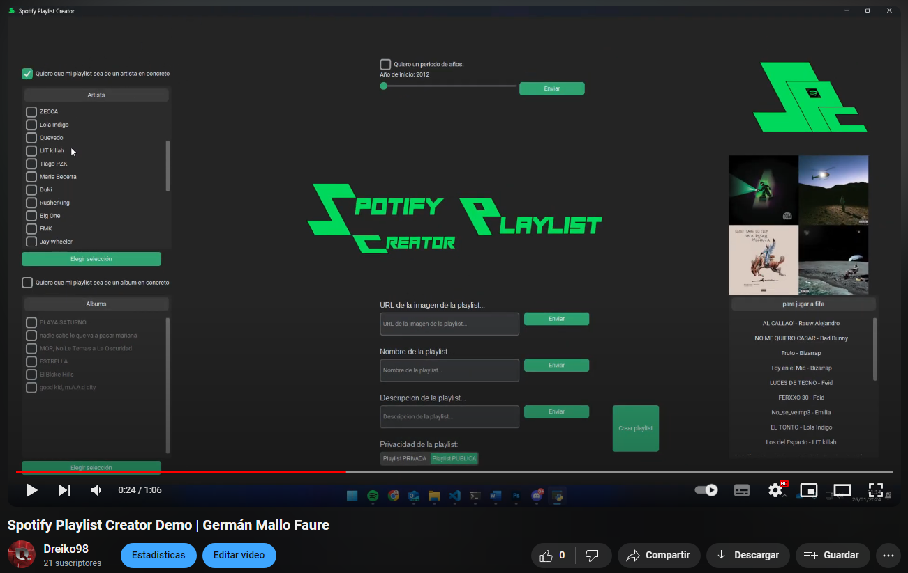
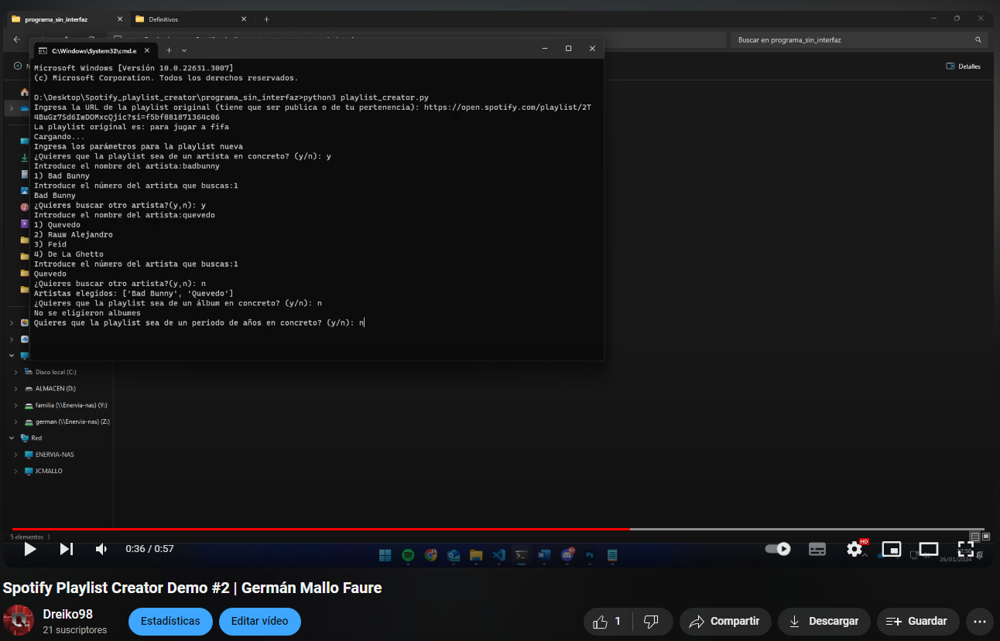

# Spotify Playlist Creator



## Description

The "Spotify Playlist Creator" program aims to create a new playlist based on an existing one, but adding the parameters desired by the user. For this purpose, both the Spotify API and the *Spotipy* library are used.

It features an interface created with the *customtkinter* library.

## Usage

Run the `playlist_creator.py` file:

```bash
python playlist_creator.py
```

1. The user is asked to enter the URL of an existing playlist, from which they wish to create the new one. (Within Spotify > select the original Playlist > Share > Copy playlist link).



2. After entering the Playlist, the browser opens with the Spotify Login page, where the user is asked to log in to their account.



3. After logging in, the interface is displayed, in which the user is asked to enter the desired parameters:


The parameters are as follows:
- Artists and albums to include: The user will select the artists and albums from their original playlist they wish to include in the new one.



- Year range: If desired, the user can choose a period of years from which songs will be selected for the new playlist.



- Playlist cover, name, description, and privacy:



After selecting the parameters, by pressing the "Crear Playlist" button, a new Playlist is generated in the user's Spotify account with the songs that meet the selected criteria.

## Usage Examples

1. With the interface.

[](https://www.youtube.com/watch?v=tBprh4jMVQo)

2. Without the interface.

[](https://www.youtube.com/watch?v=mJxrkCdkeFw)